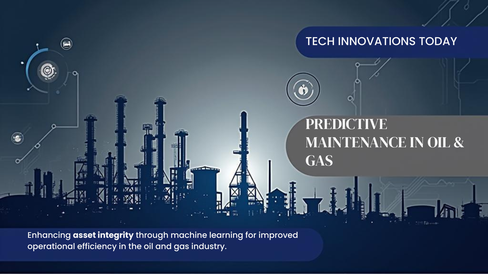

  

# Predictive Maintenance (RUL) | Oil & Gas Rotating Equipment | Python, LSTM, XGBoost

## 📌 Executive Summary
- Unplanned equipment failures in oil & gas (pumps, compressors, motors) cause costly downtime.  
- This project applies **machine learning** to predict Remaining Useful Life (RUL) using sensor data.  
- Business goal: enable predictive maintenance to **reduce downtime, improve reliability, and cut costs**.

---

## 🎯 Business Problem
Asset integrity is critical in oil & gas operations.  
Traditional maintenance = reactive (fix after failure) or scheduled (fixed intervals). Both approaches risk:  
- High downtime costs  
- Wasted resources  
- Safety/environmental risks  

**Goal:** Predict failures *before they happen* → plan maintenance windows proactively.

---

## 📊 Dataset
- **Source:** NASA C-MAPSS Turbofan Engine Degradation Dataset  
- **Mapping to oil & gas:**  
  - Engines → rotating equipment (pumps/compressors)  
  - Sensor readings → vibration, temperature, pressure  
  - Cycles → operating hours/run-time  

[🔗 Dataset link](https://www.kaggle.com/datasets)

---

## 🔧 Methodology
1. **Data Preparation**  
   - Cleaned and preprocessed time-series sensor data  
   - Feature engineering (rolling averages, degradation trends)  

2. **Exploratory Data Analysis (EDA)**  
   - Identified patterns leading up to failure  
   - Correlation analysis between sensors & RUL  

3. **Modeling**  
   - Baseline: Linear Regression, Random Forest, XGBoost  
   - Advanced: LSTM for sequence/time-series modeling  

4. **Evaluation**  
   - Metrics: RMSE, MAE for RUL prediction  
   - Business interpretation: translate predictions into maintenance windows  

---

## 📈 Results
- [Placeholder for accuracy scores and performance]  
- [Visualization: predicted RUL vs actual]  
- [Business impact estimate: downtime reduction, savings potential]  

---

## 💡 Recommendations
- Implement ML-based monitoring for critical equipment  
- Integrate predictions into maintenance planning  
- Use dashboards to guide operational decisions  

---

## 🚀 Next Steps
- Expand dataset to include real plant-level sensor data  
- Test additional models (GRU, Transformers)  
- Build full Streamlit dashboard for real-time predictions  

---

## 🛠️ Tools & Skills
- **Languages/Frameworks:** Python, pandas, scikit-learn, TensorFlow/PyTorch  
- **Visualization:** matplotlib, seaborn, Streamlit  
- **Other:** GitHub, Kaggle API, Jupyter Notebook  

---

## 👤 Author
**Mohamed Jamaludeen Hussain**  
Graduate Student in Data Analytics | 15+ Years Oil & Gas Leadership | Aspiring Data Scientist  

[LinkedIn Profile](#www.linkedin.com/in/mohamed-jamaludeen-hussain-9289a8a1) | [Email](# mojh2088@gmail.com)
